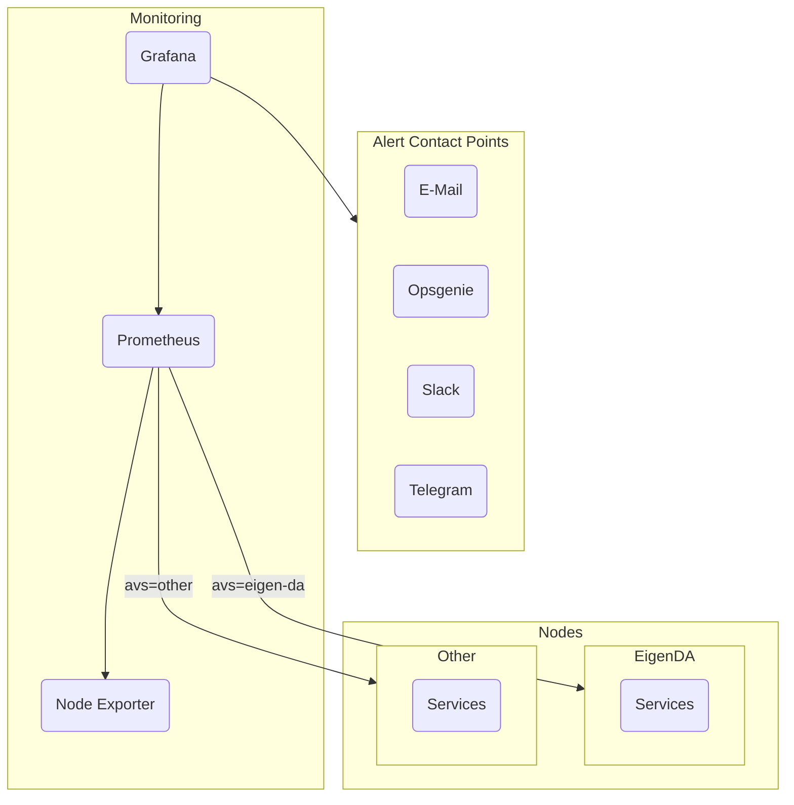

Deploying the **Monitoring Stack** is the responsibility of the [AVS setup wizard tool](../wizard/intro) and is the set of following services:

- **Prometheus** as center point of metrics collection.
- **Node Exporter** to collect metrics from the host machine.
- **Grafana** to visualize the metrics collected by Prometheus, both host and Node metrics.

The [Prometheus](/docs/monitoring/prometheus) instance would be deployed initially with the [Node Exporter](/docs/monitoring/node-exporter) as the only target. Node targets would be added dynamically by the tool when a new Node is deployed. Grafana will be deployed initially with the [Host Metrics](/docs/monitoring/grafana#host-metrics) dashboard to visualize metrics from the [Node Exporter](/docs/monitoring/node-exporter) and monitoring host resources.

Grafana supports alerting. The user can configure custom alerts for host and Node metrics. These alerts are sent to the user via Alert Contact Points, which could be configured with the AVS setup wizard tool.

